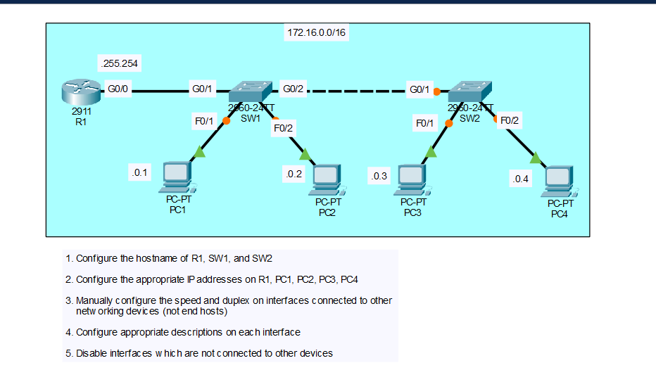

# Day 9 Lab: Switch and Router Configuration 

## Objective
Configure a router (R1) and two switches (SW1, SW2) with hostnames, interface descriptions, and manually set speed/duplex on inter-device links, then assign IP addresses to four hosts and verify end-to-end connectivity across a single shared subnet.

## Topology

The topology consists of one router (R1) connected to SW1, which is connected to SW2, with two PCs hanging off each switch. All devices share a single subnet.

| Network         | Switch | Host | Connects To |
|------------------|--------|------|-------------|
| 172.16.0.0/16    | SW1    | PC1  | SW1 F0/1    |
| 172.16.0.0/16    | SW1    | PC2  | SW1 F0/2    |
| 172.16.0.0/16    | SW2    | PC3  | SW2 F0/1    |
| 172.16.0.0/16    | SW2    | PC4  | SW2 F0/2    |

## IP Addressing Table

| Device | Interface | IP Address      | Subnet Mask       |
|--------|-----------|-----------------|--------------------|
| R1     | G0/0      | 172.16.255.254  | 255.255.0.0 (/16) |
| PC1    | NIC       | 172.16.0.1      | 255.255.0.0 (/16) |
| PC2    | NIC       | 172.16.0.2      | 255.255.0.0 (/16) |
| PC3    | NIC       | 172.16.0.3      | 255.255.0.0 (/16) |
| PC4    | NIC       | 172.16.0.4      | 255.255.0.0 (/16) |

Default gateway for each PC is R1's G0/0 interface: `172.16.255.254`

## Steps Performed

1. **Configure hostnames**
   Set the hostname on R1, SW1, and SW2 to identify each device clearly in the topology.

2. **View interfaces before configuration**
   Used `show ip interface brief` on R1 and `show interfaces status` on the switches to check existing interface states before making changes.

3. **Configure R1's interface**
   Assigned the IP address and subnet mask to R1's G0/0 interface, added a description, manually set speed and duplex (since it connects to a switch, not an end host), and enabled the interface with `no shutdown`.

4. **Configure switch uplink and downlink ports**
   On SW1, added descriptions to G0/1 (link to R1), G0/2 (link to SW2), F0/1 (link to PC1), and F0/2 (link to PC2). Manually set speed and duplex on G0/1 and G0/2, since both connect to other networking devices rather than end hosts. Repeated the equivalent steps on SW2 for its G0/1 uplink and F0/1/F0/2 downlinks.

5. **Disable unused interfaces**
   Shut down every switchport on SW1 and SW2 that was not connected to another device, to reduce the attack surface and keep the configuration clean.

6. **Verify interfaces again**
   Re-ran `show ip interface brief` on R1 and `show interfaces status` on the switches to confirm the active interfaces were up/up with the correct settings, and that unused ports showed as administratively down.

7. **Review and save the configuration**
   Viewed the running configuration with `show running-config` on all three devices to confirm the changes, then saved each configuration to NVRAM with `copy running-config startup-config`.

8. **Configure the PCs**
   Assigned static IP addresses, subnet masks, and the default gateway to PC1, PC2, PC3, and PC4 in Packet Tracer, matching each host to the shared 172.16.0.0/16 subnet.

9. **Test connectivity**
   Used `ping` between all four PCs and from each PC to R1's G0/0 interface to confirm end-to-end connectivity through SW1 and SW2.

## Key Commands Used

```
enable
configure terminal
hostname R1

interface g0/0
 description Link to SW1 G0/1
 ip address 172.16.255.254 255.255.0.0
 duplex full
 speed 100
 no shutdown
 exit

interface g0/1
 shutdown
 exit
```

```
enable
configure terminal
hostname SW1

interface g0/1
 description Link to R1 G0/0
 duplex full
 speed 100
 no shutdown
 exit

interface g0/2
 description Link to SW2 G0/1
 duplex full
 speed 100
 no shutdown
 exit

interface f0/1
 description Link to PC1
 no shutdown
 exit

interface f0/2
 description Link to PC2
 no shutdown
 exit

interface range f0/3 - 24
 shutdown
 exit
```

```
enable
configure terminal
hostname SW2

interface g0/1
 description Link to SW1 G0/2
 duplex full
 speed 100
 no shutdown
 exit

interface f0/1
 description Link to PC3
 no shutdown
 exit

interface f0/2
 description Link to PC4
 no shutdown
 exit

interface range f0/3 - 24
 shutdown
 exit
```

```
show ip interface brief
show interfaces status
show interfaces description
show running-config
copy running-config startup-config
```

## Verification
- `show ip interface brief` on R1 confirmed G0/0 was up/up with the correct IP address, and G0/1 showed administratively down.
- `show interfaces status` on SW1 and SW2 confirmed G0/1, G0/2, F0/1, and F0/2 were connected at 100 Mbps/full duplex, and all remaining FastEthernet ports showed as disabled.
- Pings between PC1, PC2, PC3, and PC4, and from each PC to R1's G0/0 interface, were all successful, confirming connectivity across the shared subnet through both switches.

## Skills Demonstrated
- Basic router and switch configuration (hostname, interfaces, descriptions)
- Manually configuring speed and duplex on inter-device links
- Disabling unused switchports as a security best practice
- IPv4 addressing on a shared subnet across multiple hosts
- Interface verification using `show` commands
- Saving and validating device configuration
- End-to-end connectivity testing with `ping`
