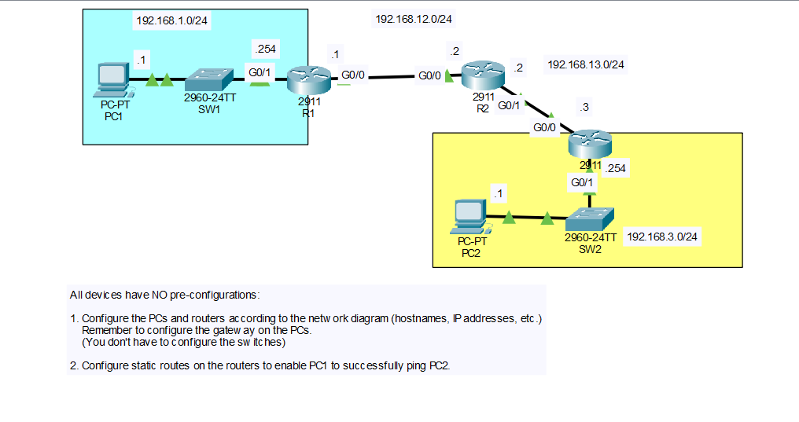

# Static Routing Lab: Three-Router Topology

## Objective
Starting from a completely unconfigured topology, configure hostnames and IP addressing on three routers, two switches' attached PCs, and add static routes so that PC1 can successfully ping PC2 across the network.

## Topology


The topology consists of three routers (R1, R2, R3) connected in a chain, with a PC/switch LAN hanging off each end router. All devices start with no pre-configuration.

| Network            | Segment                  |
|---------------------|---------------------------|
| 192.168.1.0/24      | PC1 LAN (SW1 side of R1) |
| 192.168.12.0/24     | R1 – R2 link              |
| 192.168.13.0/24     | R2 – R3 link              |
| 192.168.3.0/24      | PC2 LAN (SW2 side of R3) |

## IP Addressing Table

| Device | Interface | IP Address      | Subnet Mask     |
|--------|-----------|-----------------|-------------------|
| R1     | G0/1      | 192.168.1.254   | 255.255.255.0    |
| R1     | G0/0      | 192.168.12.1    | 255.255.255.0    |
| R2     | G0/0      | 192.168.12.2    | 255.255.255.0    |
| R2     | G0/1      | 192.168.13.2    | 255.255.255.0    |
| R3     | G0/0      | 192.168.13.3    | 255.255.255.0    |
| R3     | G0/1      | 192.168.3.254   | 255.255.255.0    |
| PC1    | NIC       | 192.168.1.1     | 255.255.255.0    |
| PC2    | NIC       | 192.168.3.1     | 255.255.255.0    |

Default gateway for PC1: `192.168.1.254`
Default gateway for PC2: `192.168.3.254`

## Steps Performed

1. **Configure hostnames**
   Set the hostname on R1, R2, and R3 to identify each router clearly in the topology. The switches (SW1, SW2) were left with default configuration, since the lab only required IP addressing on the PCs and routers.

2. **Configure router interfaces**
   Assigned the IP address and subnet mask to each router's interfaces per the addressing table above, and enabled every interface with `no shutdown`. Each router ended up with two active interfaces (one LAN-facing, one connecting toward the next router), except R2, which connects only to R1 and R3.

3. **Configure the PCs**
   Assigned a static IP address, subnet mask, and default gateway to PC1 and PC2 in Packet Tracer, matching each host to its local LAN and pointing the gateway at the directly connected router interface.

4. **Verify local connectivity before routing**
   Used `show ip interface brief` on each router to confirm all interfaces were up/up with the correct addresses, and pinged directly connected neighbors (e.g., R1 to R2, R2 to R3) to confirm each point-to-point link was working before adding static routes.

5. **Identify missing routes**
   At this point, PC1 could not reach PC2 because none of the routers had any knowledge of networks beyond their directly connected interfaces. A `ping` from PC1 to PC2 failed, and `show ip route` on each router showed only the two/three directly connected subnets.

6. **Configure static routes**
   Added static routes on R1, R2, and R3 so that traffic to every remote subnet had a next-hop toward PC2's network and back. R1 needed routes to the R2–R3 link and PC2's LAN; R2 needed routes to PC1's LAN and PC2's LAN; R3 needed routes to PC1's LAN and the R1–R2 link.

7. **Verify the routing table**
   Ran `show ip route` on each router again to confirm the static routes appeared correctly with an `S` code, pointing to the correct next-hop IP addresses.

8. **Test end-to-end connectivity**
   Used `ping` from PC1 to PC2 (and the reverse) to confirm the static routes were correctly configured and traffic could now flow across all three subnets.

## Key Commands Used

### R1

```
enable
configure terminal
hostname R1

interface g0/1
 ip address 192.168.1.254 255.255.255.0
 description ## Link to SW1 ##
 no shutdown
 exit

interface g0/0
 ip address 192.168.12.1 255.255.255.0
 description ## Link to R1 ##
 no shutdown
 exit

ip route 192.168.13.0 255.255.255.0 192.168.12.2
ip route 192.168.3.0 255.255.255.0 192.168.12.2

end
write memory
```

### R2

```
enable
configure terminal
hostname R2

interface g0/0
 ip address 192.168.12.2 255.255.255.0
 description ## Link to R1 ##
 no shutdown
 exit

interface g0/1
 ip address 192.168.13.2 255.255.255.0
 description ## Link to R3 ##
 no shutdown
 exit

ip route 192.168.1.0 255.255.255.0 192.168.12.1
ip route 192.168.3.0 255.255.255.0 192.168.13.3

end
write memory
```

### R3

```
enable
configure terminal
hostname R3

interface g0/0
 ip address 192.168.13.3 255.255.255.0
 description ## Link to R2 ##
 no shutdown
 exit

interface g0/1
 ip address 192.168.3.254 255.255.255.0
 description ## Link to SW2 ##
 no shutdown
 exit

ip route 192.168.1.0 255.255.255.0 192.168.13.2
ip route 192.168.12.0 255.255.255.0 192.168.13.2

end
write memory
```

### Verification Commands

```
show ip interface brief
show ip route
ping <destination>
```

## Verification
- `show ip interface brief` on R1, R2, and R3 confirmed all interfaces were up/up with the correct IP addresses.
- `show ip route` on each router showed the expected static (`S`) entries pointing to the correct next-hop addresses, in addition to the directly connected (`C`) networks.
- A ping from PC1 (192.168.1.1) to PC2 (192.168.3.1) succeeded, and the reverse ping from PC2 to PC1 also succeeded, confirming full end-to-end connectivity across the three-router topology.

## Skills Demonstrated
- Basic router configuration from a blank/default state (hostname, interfaces)
- IPv4 addressing across multiple point-to-point and LAN subnets
- Configuring default gateways on end hosts
- Static route configuration (`ip route`) across a multi-hop topology
- Routing table verification with `show ip route`
- End-to-end connectivity testing with `ping`
