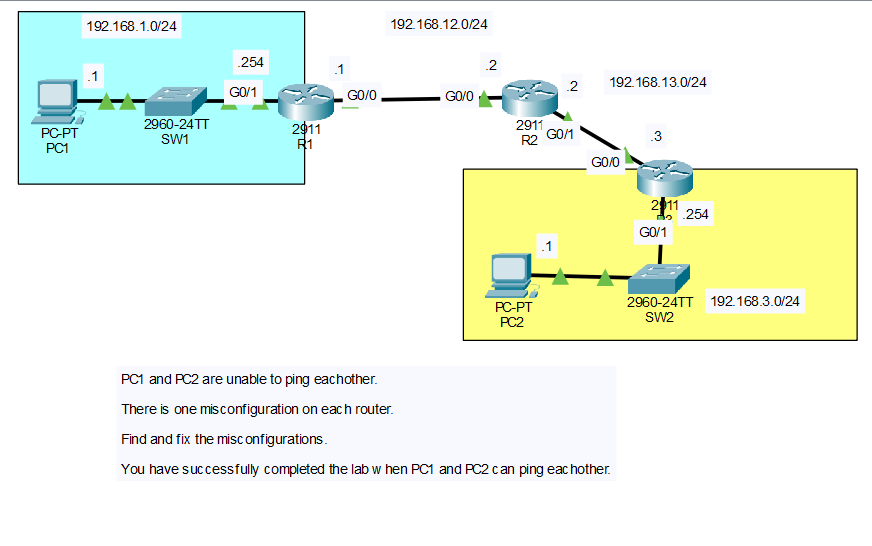

# Day 11: Static Routing Troubleshooting Lab

## Objective
Starting from a topology where PC1 and PC2 cannot ping each other, locate and fix exactly one misconfiguration on each of the three routers (R1, R2, R3), then verify end-to-end connectivity between PC1 and PC2.

## Topology


The topology consists of three routers (R1, R2, R3) connected in a chain, with a PC/switch LAN hanging off each end router.

| Network            | Segment                  |
|---------------------|---------------------------|
| 192.168.1.0/24      | PC1 LAN (SW1 side of R1) |
| 192.168.12.0/24     | R1 – R2 link              |
| 192.168.13.0/24     | R2 – R3 link              |
| 192.168.3.0/24      | PC2 LAN (SW2 side of R3) |

## IP Addressing Table

| Device | Interface | IP Address      | Subnet Mask     |
|--------|-----------|-----------------|-------------------|
| R1     | G0/1      | 192.168.1.254   | 255.255.255.0    |
| R1     | G0/0      | 192.168.12.1    | 255.255.255.0    |
| R2     | G0/0      | 192.168.12.2    | 255.255.255.0    |
| R2     | G0/1      | 192.168.13.2    | 255.255.255.0    |
| R3     | G0/0      | 192.168.13.3    | 255.255.255.0    |
| R3     | G0/1      | 192.168.3.254   | 255.255.255.0    |
| PC1    | NIC       | 192.168.1.1     | 255.255.255.0    |
| PC2    | NIC       | 192.168.3.1     | 255.255.255.0    |

## Symptom
PC1 and PC2 could not ping each other. IP addressing on the end hosts and directly connected interfaces was otherwise in place, and the problem statement indicated exactly one misconfiguration existed on each router.

## Troubleshooting Process

### R1 — Wrong next-hop address in a static route

Running `show ip route` on R1 showed no route to PC2's subnet (192.168.3.0/24), even though a static route had clearly been attempted. Checking the running configuration revealed the route pointed to a next-hop address that doesn't exist on the R1–R2 link:

```
ip route 192.168.3.0 255.255.255.0 192.168.12.3
```

R2's G0/0 interface is actually `192.168.12.2`, not `.3`, so the route was unusable and never installed in the routing table. **Fix:** removed the bad route and re-added it with the correct next-hop.

```
no ip route 192.168.3.0 255.255.255.0 192.168.12.3
ip route 192.168.3.0 255.255.255.0 192.168.12.2
```

After the fix, `show ip route` confirmed `S 192.168.3.0/24 [1/0] via 192.168.12.2`.

### R2 — Static route pointed out the wrong exit interface

On R2, `show ip route` showed the route to PC2's subnet as if it were directly connected out GigabitEthernet0/0 — the interface facing **R1**, not R3:

```
S    192.168.3.0/24 is directly connected, GigabitEthernet0/0
```

This happened because the static route had been configured with an exit interface (`g0/0`) instead of the correct next-hop address, sending traffic for PC2's network back toward R1 instead of on toward R3. **Fix:** removed the bad route and re-added it using R3's directly connected address as the next-hop.

```
no ip route 192.168.3.0 255.255.255.0 g0/0
ip route 192.168.3.0 255.255.255.0 192.168.13.3
```

### R3 — Interface configured on the wrong subnet

On R3, `show ip route` and `show ip interface brief` revealed GigabitEthernet0/0 was addressed on a subnet that didn't match R2's side of the link at all:

```
GigabitEthernet0/0    192.168.23.3   YES manual up   up
```

The link between R2 and R3 should be `192.168.13.0/24`, but R3's G0/0 had been typo'd into `192.168.23.3/24` — one digit off. Since R3 wasn't even on the same subnet as R2's G0/1 (`192.168.13.2`), the two routers could never form a working link, regardless of any static routes. **Fix:** re-addressed the interface with the correct subnet.

```
interface g0/0
 ip address 192.168.13.3 255.255.255.0
```

After the fix, `show ip route` confirmed R3 saw `192.168.13.0/24` as directly connected and the previously-configured static route `S 192.168.1.0/24 [1/0] via 192.168.13.2` became reachable.

## Root Cause Summary

| Router | Misconfiguration                                              | Fix                                                              |
|--------|-----------------------------------------------------------------|--------------------------------------------------------------------|
| R1     | Static route used wrong next-hop (`192.168.12.3` instead of `.2`) | Re-added the route with next-hop `192.168.12.2`                  |
| R2     | Static route used wrong exit interface (`g0/0` instead of pointing toward R3) | Re-added the route with next-hop `192.168.13.3`                  |
| R3     | G0/0 addressed on the wrong subnet (`192.168.23.3/24` instead of `192.168.13.3/24`) | Corrected the interface address to `192.168.13.3/24`              |

## Verification Commands Used

```
show ip route
show ip interface brief
ping <destination>
```

## Verification
- `show ip route` on all three routers showed correct connected (`C`), local (`L`), and static (`S`) entries with valid next-hops after each fix.
- A ping from PC1 (192.168.1.1) to PC2 (192.168.3.1) succeeded, and the reverse ping from PC2 to PC1 also succeeded, confirming the lab's success criteria was met.

## Skills Demonstrated
- Reading and interpreting `show ip route` output to spot invalid or misdirected static routes
- Diagnosing the difference between a route configured with a next-hop IP vs. an exit interface, and why that distinction matters
- Identifying an interface misconfigured on the wrong subnet using `show ip interface brief`
- Correcting static routes with `no ip route` / `ip route`
- Systematic, router-by-router troubleshooting methodology
- End-to-end connectivity verification with `ping`
