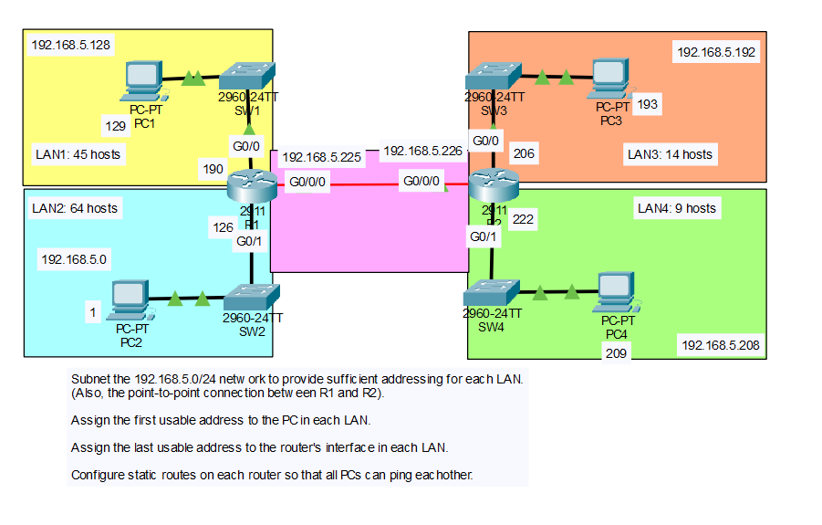

# VLSM Subnetting and Static Routing Lab

## Objective
Subnet a single `192.168.5.0/24` network using Variable Length Subnet Masking (VLSM) to efficiently address four LANs of different sizes plus a point-to-point link between two routers, assign the first usable address to each LAN's PC and the last usable address to each LAN's router interface, and configure static routes so every PC across both routers can ping each other.

## Topology


Two routers (R1, R2) are connected point-to-point. R1 serves two LANs (LAN1 and LAN2) and R2 serves two LANs (LAN3 and LAN4).

| LAN  | Hosts Required | Router | Switch |
|------|------------------|--------|--------|
| LAN1 | 45               | R1     | SW1    |
| LAN2 | 64               | R1     | SW2    |
| LAN3 | 14               | R2     | SW3    |
| LAN4 | 9                | R2     | SW4    |

## VLSM Design

Subnets were allocated largest-requirement-first to make the most efficient use of `192.168.5.0/24`:

| LAN / Link | Hosts Needed | Subnet Mask | Network           | Usable Range                  | Broadcast         |
|------------|---------------|-------------|--------------------|---------------------------------|---------------------|
| LAN2       | 64            | /25         | 192.168.5.0/25     | 192.168.5.1 – 192.168.5.126    | 192.168.5.127      |
| LAN1       | 45            | /26         | 192.168.5.128/26   | 192.168.5.129 – 192.168.5.190  | 192.168.5.191      |
| LAN3       | 14            | /28         | 192.168.5.192/28   | 192.168.5.193 – 192.168.5.206  | 192.168.5.207      |
| LAN4       | 9             | /28         | 192.168.5.208/28   | 192.168.5.209 – 192.168.5.222  | 192.168.5.223      |
| R1–R2 link | 2             | /30         | 192.168.5.224/30   | 192.168.5.225 – 192.168.5.226  | 192.168.5.227      |

LAN2 needed a `/25` (126 usable addresses) rather than a `/26`, since a `/26` only provides 62 usable addresses — not enough for 64 hosts. The remaining `192.168.5.228 – 192.168.5.255` range is left unused.

## IP Addressing Table

Per the lab requirements, each LAN's PC was given the **first usable address**, and each LAN's router interface was given the **last usable address**.

| Device | Interface   | IP Address       | Subnet Mask         |
|--------|-------------|-------------------|------------------------|
| PC1    | NIC         | 192.168.5.129    | 255.255.255.192 (/26) |
| PC2    | NIC         | 192.168.5.1      | 255.255.255.128 (/25) |
| PC3    | NIC         | 192.168.5.193    | 255.255.255.240 (/28) |
| PC4    | NIC         | 192.168.5.209    | 255.255.255.240 (/28) |
| R1     | G0/0 (LAN1) | 192.168.5.190    | 255.255.255.192 (/26) |
| R1     | G0/1 (LAN2) | 192.168.5.126    | 255.255.255.128 (/25) |
| R1     | G0/0/0      | 192.168.5.225    | 255.255.255.252 (/30) |
| R2     | G0/0 (LAN3) | 192.168.5.206    | 255.255.255.240 (/28) |
| R2     | G0/1 (LAN4) | 192.168.5.222    | 255.255.255.240 (/28) |
| R2     | G0/0/0      | 192.168.5.226    | 255.255.255.252 (/30) |

Default gateway for each PC is its directly connected router interface above.

## Steps Performed

1. **Determine subnet sizes with VLSM**
   Listed all five address requirements (four LANs plus the R1–R2 link), sorted them from largest to smallest, and allocated contiguous blocks out of `192.168.5.0/24` so each subnet is only as large as it needs to be — avoiding the waste of giving every segment a single fixed mask.

2. **Assign addressing per the lab's rule**
   Within each subnet, assigned the **first usable address** to the PC and the **last usable address** to the router interface, as specified in the lab instructions.

3. **Configure the routers**
   Set the IP address and subnet mask on each of R1's and R2's three interfaces (two LAN-facing, one point-to-point), and enabled each with `no shutdown`.

4. **Configure the PCs**
   Assigned the static IP address, subnet mask, and default gateway to PC1, PC2, PC3, and PC4 in Packet Tracer, matching each host to its LAN.

5. **Verify local connectivity before routing**
   Used `show ip interface brief` on R1 and R2 to confirm all interfaces were up/up with the correct addresses, and pinged across the R1–R2 point-to-point link to confirm it was working before adding static routes.

6. **Configure static routes**
   Added static routes on R1 for the two networks reachable only through R2 (LAN3 and LAN4), and on R2 for the two networks reachable only through R1 (LAN1 and LAN2), using the opposite router's point-to-point address as the next-hop.

7. **Verify the routing table**
   Ran `show ip route` on both routers to confirm the static routes appeared with the correct next-hop and subnet mask.

8. **Test end-to-end connectivity**
   Pinged between PC1, PC2, PC3, and PC4 in every combination to confirm all four LANs could reach each other through R1 and R2.

## Key Commands Used

### R1

```
enable
configure terminal
hostname R1

interface g0/0
 ip address 192.168.5.190 255.255.255.192
 no shutdown
 exit

interface g0/1
 ip address 192.168.5.126 255.255.255.128
 no shutdown
 exit

interface g0/0/0
 ip address 192.168.5.225 255.255.255.252
 no shutdown
 exit

ip route 192.168.5.192 255.255.255.240 192.168.5.226
ip route 192.168.5.208 255.255.255.240 192.168.5.226

end
write memory
```

### R2

```
enable
configure terminal
hostname R2

interface g0/0
 ip address 192.168.5.206 255.255.255.240
 no shutdown
 exit

interface g0/1
 ip address 192.168.5.222 255.255.255.240
 no shutdown
 exit

interface g0/0/0
 ip address 192.168.5.226 255.255.255.252
 no shutdown
 exit

ip route 192.168.5.128 255.255.255.192 192.168.5.225
ip route 192.168.5.0 255.255.255.128 192.168.5.225

end
write memory
```

### Verification Commands

```
show ip interface brief
show ip route
ping <destination>
```

## Verification
- `show ip interface brief` on R1 and R2 confirmed all six router interfaces were up/up with the VLSM-calculated addresses.
- `show ip route` on both routers showed the correct directly connected (`C`) and static (`S`) entries, each static route pointing to the correct point-to-point next-hop.
- Pings between all four PCs succeeded in every direction, confirming the VLSM addressing and static routes were configured correctly.

## Skills Demonstrated
- Calculating VLSM subnets from a single address block based on per-LAN host requirements
- Efficient address allocation (largest-to-smallest) to minimize wasted address space
- Assigning first/last usable addresses according to a defined addressing policy
- Static route configuration across a point-to-point link
- Routing table verification with `show ip route`
- End-to-end connectivity testing with `ping`
