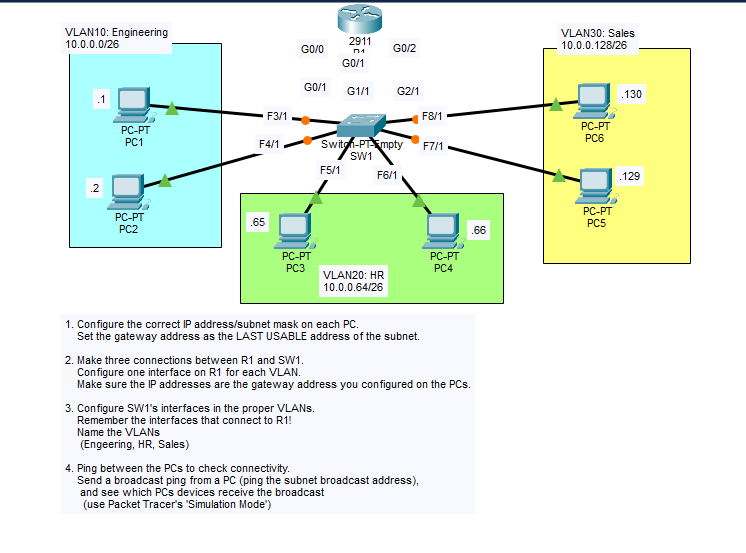

# Day 16 Lab: VLANs, Subnetting and Inter-VLAN Routing

## Objective

Divide the `10.0.0.0` network into three /26 subnets, configure three VLANs (Engineering, HR, Sales) on a single switch (SW1), connect SW1 to a router (R1) with one link per VLAN, and verify the configuration and connectivity between hosts.

## Topology



## Subnet Breakdown

Each VLAN uses a `/26` mask (`255.255.255.192`), giving 64 addresses per subnet and 62 usable hosts.

| VLAN | Network Address | First Usable | Last Usable (Gateway) | Broadcast Address |
|------|-----------------|--------------|-----------------------|-------------------|
| 10 - ENGINEERING | 10.0.0.0 | 10.0.0.1 | 10.0.0.62 | 10.0.0.63 |
| 20 - HR | 10.0.0.64 | 10.0.0.65 | 10.0.0.126 | 10.0.0.127 |
| 30 - SALES | 10.0.0.128 | 10.0.0.129 | 10.0.0.190 | 10.0.0.191 |

## IP Addressing Table

| Device | Interface | IP Address | Subnet Mask | Default Gateway |
|--------|-----------|------------|-------------|-----------------|
| R1 | G0/0 | 10.0.0.62 | 255.255.255.192 | N/A |
| R1 | G0/1 | 10.0.0.126 | 255.255.255.192 | N/A |
| R1 | G0/2 | 10.0.0.190 | 255.255.255.192 | N/A |
| PC1 | NIC | 10.0.0.1 | 255.255.255.192 | 10.0.0.62 |
| PC2 | NIC | 10.0.0.2 | 255.255.255.192 | 10.0.0.62 |
| PC3 | NIC | 10.0.0.65 | 255.255.255.192 | 10.0.0.126 |
| PC4 | NIC | 10.0.0.66 | 255.255.255.192 | 10.0.0.126 |
| PC5 | NIC | 10.0.0.129 | 255.255.255.192 | 10.0.0.190 |
| PC6 | NIC | 10.0.0.130 | 255.255.255.192 | 10.0.0.190 |

The default gateway for each PC is the **last usable address** of its subnet, which is also the IP address configured on the matching R1 interface.

## Steps Performed

1. **Configure the PCs**
   Assigned a static IP address, subnet mask (`255.255.255.192`), and default gateway to PC1-PC6 in Packet Tracer. The gateway for each PC is the last usable address of its subnet.

2. **Configure R1's interfaces**
   Made three connections between R1 and SW1 and configured one interface on R1 per VLAN. Each interface uses the same IP address that was set as the gateway on the PCs. Enabled each interface with `no shutdown`.

3. **Create the VLANs on SW1**
   Created VLAN 10, VLAN 20, and VLAN 30 and named them ENGINEERING, HR, and SALES.

4. **Assign SW1 interfaces to VLANs**
   Placed the PC-facing ports (Fa3/1-Fa8/1) in their proper VLANs. Also assigned the three ports that connect to R1 (Gig0/1, Gig1/1, Gig2/1) to the VLAN matching the R1 interface they connect to.

5. **Verify the configuration**
   Used `show vlan brief` on SW1 and `show ip interface brief` on R1 to confirm VLAN membership and that all router interfaces were up/up.

6. **Test connectivity**
   Pinged between PCs in the same VLAN and across different VLANs to confirm routing through R1.

7. **Test broadcast behavior**
   Sent a broadcast ping from a PC (the subnet broadcast address) and used Packet Tracer's **Simulation Mode** to observe which PCs received the broadcast.

## Key Commands Used

### R1 Configuration

```
enable
configure terminal
hostname R1

interface g0/0
 description Link to SW1 - VLAN10 Engineering
 ip address 10.0.0.62 255.255.255.192
 no shutdown

interface g0/1
 description Link to SW1 - VLAN20 HR
 ip address 10.0.0.126 255.255.255.192
 no shutdown

interface g0/2
 description Link to SW1 - VLAN30 Sales
 ip address 10.0.0.190 255.255.255.192
 no shutdown

end
show ip interface brief
copy running-config startup-config
```

### SW1 Configuration

```
enable
configure terminal
hostname SW1

vlan 10
 name ENGINEERING
vlan 20
 name HR
vlan 30
 name SALES
exit

! VLAN 10 - ENGINEERING (PC1, PC2, link to R1 G0/0)
interface range f3/1 - 4/1 , g0/1
 switchport mode access
 switchport access vlan 10

! VLAN 20 - HR (PC3, PC4, link to R1 G0/1)
interface range f5/1 - 6/1 , g1/1
 switchport mode access
 switchport access vlan 20

! VLAN 30 - SALES (PC5, PC6, link to R1 G0/2)
interface range f7/1 - 8/1 , g2/1
 switchport mode access
 switchport access vlan 30

end
show vlan brief
copy running-config startup-config
```

### PC Configuration (Desktop > IP Configuration)

| PC | IP Address | Subnet Mask | Default Gateway |
|----|------------|-------------|-----------------|
| PC1 | 10.0.0.1 | 255.255.255.192 | 10.0.0.62 |
| PC2 | 10.0.0.2 | 255.255.255.192 | 10.0.0.62 |
| PC3 | 10.0.0.65 | 255.255.255.192 | 10.0.0.126 |
| PC4 | 10.0.0.66 | 255.255.255.192 | 10.0.0.126 |
| PC5 | 10.0.0.129 | 255.255.255.192 | 10.0.0.190 |
| PC6 | 10.0.0.130 | 255.255.255.192 | 10.0.0.190 |

## Verification

### SW1: `show vlan brief`


```
VLAN Name                             Status    Ports
---- -------------------------------- --------- -------------------------------
1    default                          active    Fa9/1
10   ENGINEERING                      active    Gig0/1, Fa3/1, Fa4/1
20   HR                               active    Gig1/1, Fa5/1, Fa6/1
30   SALES                            active    Gig2/1, Fa7/1, Fa8/1
1002 fddi-default                     active
```

- VLANs 10, 20, and 30 exist with the names ENGINEERING, HR, and SALES.
- Each VLAN contains its two PC ports plus the port that connects to R1.
- Fa9/1 is unused and remains in the default VLAN 1.

### R1: `show ip interface brief`


```
Interface              IP-Address      OK? Method Status                Protocol
GigabitEthernet0/0     10.0.0.62       YES manual up                    up
GigabitEthernet0/1     10.0.0.126      YES manual up                    up
GigabitEthernet0/2     10.0.0.190      YES manual up                    up
Vlan1                  unassigned      YES unset  administratively down down
```

- All three R1 interfaces are **up/up** with the correct gateway addresses for their VLANs.
- Vlan1 is unassigned and administratively down, which is expected because it is not used in this lab.

### Connectivity

- Pings between PCs in the same VLAN (e.g., PC1 to PC2) and across VLANs (e.g., PC1 to PC3, PC1 to PC5) confirm that R1 routes between the three subnets.

### Broadcast Test (Simulation Mode)

A broadcast ping was sent from a PC to its subnet's broadcast address.

| Source | Broadcast Target | Expected Receivers |
|--------|------------------|--------------------|
| PC1 | 10.0.0.63 | PC2 (and R1 G0/0) |
| PC3 | 10.0.0.127 | PC4 (and R1 G0/1) |
| PC5 | 10.0.0.191 | PC6 (and R1 G0/2) |

**Observation:** Only devices in the same VLAN receive the broadcast. PCs in the other VLANs do not, showing that VLANs create separate broadcast domains and that the router does not forward broadcasts.

## Skills Demonstrated

- Subnetting a larger network into equal /26 subnets
- Calculating network, usable range, gateway, and broadcast addresses
- Creating and naming VLANs on a switch
- Assigning access ports to VLANs
- Configuring router interfaces to route between VLANs
- Verification with `show vlan brief` and `show ip interface brief`
- Connectivity and broadcast domain testing using ping and Packet Tracer Simulation Mode
