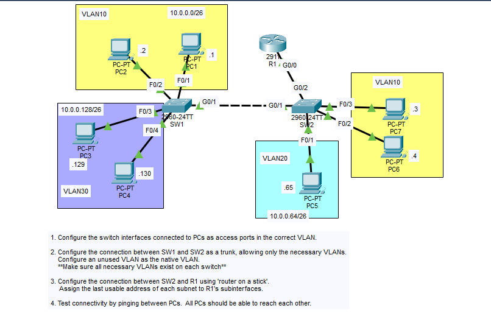

Day 17: VLANs, 802.1Q Trunking and Router-on-a-Stick

## Objective

Configure access ports for PCs on two switches (SW1 and SW2), connect the switches with an 802.1Q trunk that allows only the necessary VLANs and uses an unused native VLAN, and configure R1 as a "router-on-a-stick" using subinterfaces so that all PCs in all VLANs can reach each other.

## Topology



## Subnet Breakdown

The `10.0.0.0` address space is divided into three `/26` subnets (`255.255.255.192`), giving 64 addresses per subnet and 62 usable hosts. The default gateway for each VLAN is the **last usable address** of its subnet and is assigned to the matching R1 subinterface.

| VLAN | Network Address | First Usable | Last Usable (Gateway) | Broadcast Address |
|------|-----------------|--------------|-----------------------|-------------------|
| 10 | 10.0.0.0/26 | 10.0.0.1 | 10.0.0.62 | 10.0.0.63 |
| 20 | 10.0.0.64/26 | 10.0.0.65 | 10.0.0.126 | 10.0.0.127 |
| 30 | 10.0.0.128/26 | 10.0.0.129 | 10.0.0.190 | 10.0.0.191 |

## Port and VLAN Assignment

| Device | Port | Connected To | VLAN / Mode |
|--------|------|--------------|-------------|
| SW1 | F0/1 | PC1 | VLAN 10 (access) |
| SW1 | F0/2 | PC2 | VLAN 10 (access) |
| SW1 | F0/3 | PC3 | VLAN 30 (access) |
| SW1 | F0/4 | PC4 | VLAN 30 (access) |
| SW1 | G0/1 | SW2 G0/1 | Trunk |
| SW2 | F0/1 | PC5 | VLAN 20 (access) |
| SW2 | F0/2 | PC6 | VLAN 10 (access) |
| SW2 | F0/3 | PC7 | VLAN 10 (access) |
| SW2 | G0/1 | SW1 G0/1 | Trunk |
| SW2 | G0/2 | R1 G0/0 | Trunk |

## IP Addressing Table

| Device | Interface | VLAN | IP Address | Subnet Mask | Default Gateway |
|--------|-----------|------|------------|-------------|-----------------|
| R1 | G0/0.10 | 10 | 10.0.0.62 | 255.255.255.192 | N/A |
| R1 | G0/0.20 | 20 | 10.0.0.126 | 255.255.255.192 | N/A |
| R1 | G0/0.30 | 30 | 10.0.0.190 | 255.255.255.192 | N/A |
| PC1 | NIC | 10 | 10.0.0.1 | 255.255.255.192 | 10.0.0.62 |
| PC2 | NIC | 10 | 10.0.0.2 | 255.255.255.192 | 10.0.0.62 |
| PC7 | NIC | 10 | 10.0.0.3 | 255.255.255.192 | 10.0.0.62 |
| PC6 | NIC | 10 | 10.0.0.4 | 255.255.255.192 | 10.0.0.62 |
| PC5 | NIC | 20 | 10.0.0.65 | 255.255.255.192 | 10.0.0.126 |
| PC3 | NIC | 30 | 10.0.0.129 | 255.255.255.192 | 10.0.0.190 |
| PC4 | NIC | 30 | 10.0.0.130 | 255.255.255.192 | 10.0.0.190 |

## Steps Performed

1. **Create the VLANs on both switches**
   Created VLANs 10, 30, and the unused native VLAN 99 on SW1. Created VLANs 10, 20, 30, and 99 on SW2. VLAN 20 is only needed on SW2 because PC5 is the only VLAN 20 host and it connects to SW2. VLAN 30 must also exist on SW2 (even with no VLAN 30 hosts there) so it can be carried over the trunk to R1.

2. **Configure access ports**
   Configured the PC-facing ports on SW1 and SW2 as access ports in the correct VLAN.

3. **Configure the SW1-SW2 trunk**
   Set the link between SW1 G0/1 and SW2 G0/1 as an 802.1Q trunk. Restricted the allowed VLANs to 10 and 30 only (there are no VLAN 20 hosts on SW1, so VLAN 20 does not need to cross this trunk), and changed the native VLAN to the unused VLAN 99.

4. **Configure the SW2-R1 trunk**
   Set SW2 G0/2 (the port facing R1) as a trunk allowing VLANs 10, 20, and 30 with native VLAN 99, since R1 needs to receive tagged traffic for all three VLANs on one physical link.

5. **Configure R1 subinterfaces (router-on-a-stick)**
   Created one subinterface on R1 G0/0 per VLAN (G0/0.10, G0/0.20, G0/0.30), set each to the correct 802.1Q encapsulation, and assigned the last usable address of each subnet. Enabled the physical interface with `no shutdown`.

6. **Configure the PCs**
   Assigned static IP addresses, subnet masks, and default gateways to PC1-PC7 in Packet Tracer.

7. **Verify and test connectivity**
   Checked the trunks, VLANs, and router interfaces with show commands, then pinged between PCs in the same VLAN and across different VLANs.

## Key Commands Used

### SW1 Configuration

```
enable
configure terminal
hostname SW1

vlan 10
vlan 30
vlan 99
 name NATIVE-UNUSED
exit

interface range f0/1 - 2
 switchport mode access
 switchport access vlan 10

interface range f0/3 - 4
 switchport mode access
 switchport access vlan 30

interface g0/1
 switchport mode trunk
 switchport trunk native vlan 99
 switchport trunk allowed vlan 10,30

end
copy running-config startup-config
```

### SW2 Configuration

```
enable
configure terminal
hostname SW2

vlan 10
vlan 20
vlan 30
vlan 99
 name NATIVE-UNUSED
exit

interface range f0/2 - 3
 switchport mode access
 switchport access vlan 10

interface f0/1
 switchport mode access
 switchport access vlan 20

! Trunk to SW1 (VLAN 20 is not needed on this link)
interface g0/1
 switchport mode trunk
 switchport trunk native vlan 99
 switchport trunk allowed vlan 10,30

! Trunk to R1 (router-on-a-stick, all three VLANs)
interface g0/2
 switchport mode trunk
 switchport trunk native vlan 99
 switchport trunk allowed vlan 10,20,30

end
copy running-config startup-config
```

### R1 Configuration

```
enable
configure terminal
hostname R1

interface g0/0
 no shutdown

interface g0/0.10
 description Gateway for VLAN 10
 encapsulation dot1q 10
 ip address 10.0.0.62 255.255.255.192

interface g0/0.20
 description Gateway for VLAN 20
 encapsulation dot1q 20
 ip address 10.0.0.126 255.255.255.192

interface g0/0.30
 description Gateway for VLAN 30
 encapsulation dot1q 30
 ip address 10.0.0.190 255.255.255.192

end
copy running-config startup-config
```

### PC Configuration (Desktop > IP Configuration)

| PC | IP Address | Subnet Mask | Default Gateway |
|----|------------|-------------|-----------------|
| PC1 | 10.0.0.1 | 255.255.255.192 | 10.0.0.62 |
| PC2 | 10.0.0.2 | 255.255.255.192 | 10.0.0.62 |
| PC7 | 10.0.0.3 | 255.255.255.192 | 10.0.0.62 |
| PC6 | 10.0.0.4 | 255.255.255.192 | 10.0.0.62 |
| PC5 | 10.0.0.65 | 255.255.255.192 | 10.0.0.126 |
| PC3 | 10.0.0.129 | 255.255.255.192 | 10.0.0.190 |
| PC4 | 10.0.0.130 | 255.255.255.192 | 10.0.0.190 |

## Verification

### SW1 and SW2: `show vlan brief`

- SW1 has VLANs 10, 30, and 99. SW2 has VLANs 10, 20, 30, and 99.
- Each PC port is listed under the correct VLAN.

### SW1 and SW2: `show interfaces trunk`

- The trunk ports (SW1 G0/1, SW2 G0/1, SW2 G0/2) are in trunking mode using 802.1Q.
- The native VLAN is 99.
- The SW1-SW2 trunk allows only VLANs 10 and 30.
- The SW2-R1 trunk allows VLANs 10, 20, and 30.

### R1: `show ip interface brief`

- G0/0 is up/up, and subinterfaces G0/0.10, G0/0.20, and G0/0.30 are up/up with 10.0.0.62, 10.0.0.126, and 10.0.0.190.

### Connectivity Tests

| Test | Source | Destination | Type |
|------|--------|-------------|------|
| 1 | PC1 | PC2 | Same VLAN, same switch |
| 2 | PC1 | PC7 | Same VLAN, across the SW1-SW2 trunk |
| 3 | PC1 | PC3 | Inter-VLAN (10 to 30), routed by R1 |
| 4 | PC1 | PC5 | Inter-VLAN (10 to 20), routed by R1 |
| 5 | PC4 | PC5 | Inter-VLAN (30 to 20), routed by R1 |
| 6 | PC6 | PC4 | Inter-VLAN (10 to 30), routed by R1 |

All pings were successful, confirming that every PC can reach every other PC. Traffic between VLANs travels across the trunks to R1, is routed through the matching subinterfaces, and returns over the same physical link.

## Skills Demonstrated

- Configuring access ports and assigning VLANs on multiple switches
- Creating only the VLANs each switch needs so they can be carried over a trunk
- Configuring 802.1Q trunks, restricting allowed VLANs, and changing the native VLAN to an unused VLAN
- Configuring inter-VLAN routing with router-on-a-stick (subinterfaces and dot1q encapsulation)
- Subnetting a network into /26 subnets and assigning the last usable address as the gateway
- Verification with `show vlan brief`, `show interfaces trunk`, and `show ip interface brief`
- End-to-end connectivity testing with ping
